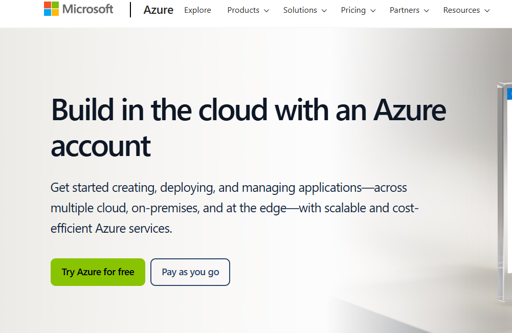

# How to Create an Azure Account

This tutorial guides you through creating a Microsoft Azure account step by step.

## Step 1: Navigate to the Azure Signup Page
Go to the [Azure Signup Page](https://azure.microsoft.com/en-us/free/).

---

## Step 2: Fill in Your Details
1. Click **Start for free**.
2. Enter your personal details, including your name and email address.

---

## Step 3: Verify Your Identity
- Provide your phone number for SMS or call verification.
- Enter the received code.

---

## Step 4: Set Up Your Payment Information
1. Enter your credit or debit card details for account verification.
   
---

## Step 5: Start Exploring Azure
After successful verification, you will be redirected to the Azure portal.

---

All screenshots used in this tutorial are available in the `/images` directory of this repository.

---

## Repository Link
This tutorial is hosted on GitHub at [Your Repository Link](#).
