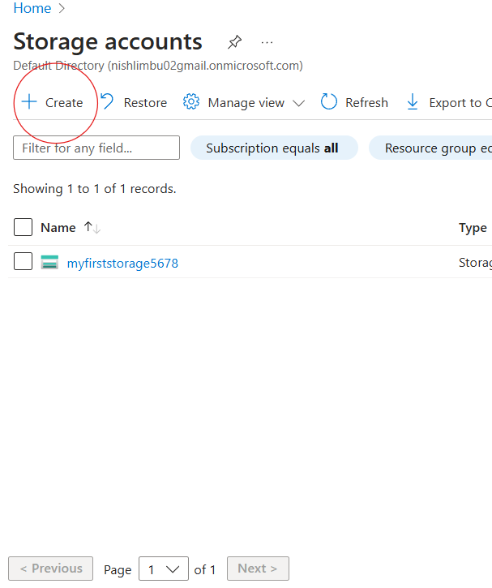

# How to Create an Azure Account

This tutorial guides you through creating a Microsoft Azure account step by step.

## Prerequisites
- A valid email address
- A phone number for verification
- A credit or debit card (for verification, no charges will be made)

---

## Step 1: Navigate to the Azure Signup Page
Go to the [Azure Signup Page](https://azure.microsoft.com/en-us/free/).

---

## Step 2: Fill in Your Details
1. Click **Start for free**.
2. Enter your personal details, including your name and email address.

---

## Step 3: Verify Your Identity
- Provide your phone number for SMS or call verification.
- Enter the received code.

---

## Step 4: Set Up Your Payment Information
1. Enter your credit or debit card details for account verification.
   > **Note:** No charges will be made unless you exceed the free-tier limits.
   
---

## Step 5: Start Exploring Azure
After successful verification, you will be redirected to the Azure portal.

Congratulations! You've successfully created your Azure account.

---

## Next Steps
- Create a Resource Group
- Set up a Storage Account
- Launch a Virtual Machine

For more tutorials, check out the repository!

# How to Use Azure: Resource Groups and Storage Accounts

This tutorial extends the process of creating an Azure account by demonstrating how to create a Resource Group and a Storage Account.

---

## Table of Contents
- [Introduction](#introduction)
- [Step 1: Create a Resource Group](#step-1-create-a-resource-group)
- [Step 2: Create a Storage Account](#step-2-create-a-storage-account)
- [Conclusion](#conclusion)

---

## Introduction

Azure's **Resource Groups** help organize resources logically for easier management. A **Storage Account** is a scalable cloud storage solution for files, blobs, queues, and tables.

---

## Step 1: Create a Resource Group

1. Log into the [Azure Portal](https://portal.azure.com).
2. In the left-hand menu, select **Resource Groups**.
3. Click **+ Create**.

   

4. Fill out the required details:
   - **Subscription:** Select your Azure subscription.
   - **Resource Group Name:** Enter a unique name (e.g., `my-first-resource-group`).
   - **Region:** Choose the location where your resources will reside.

   

5. Click **Review + Create**, then **Create**.

---

## Step 2: Create a Storage Account

1. Navigate to **Storage Accounts** from the Azure Portal menu.
2. Click **+ Create**.

   

3. Fill out the required details:
   - **Subscription:** Choose your subscription.
   - **Resource Group:** Select the group you just created.
   - **Storage Account Name:** Enter a globally unique name (e.g., `myfirststorageacct`).
   - **Region:** Select a region (preferably the same as your resource group).
   - **Performance:** Choose **Standard** for general-purpose storage.
   - **Replication:** Select a replication option (e.g., **Locally-redundant storage**).

   

4. Click **Review + Create**, then **Create**.

---

## Conclusion

Congratulations! You've successfully created:
- A Resource Group for logical resource organization.
- A Storage Account for scalable cloud storage.

### What's Next?
- Learn how to create a Virtual Machine within the Resource Group.
- Explore advanced storage settings, such as access tiers and shared access signatures.

Check out the next section of the tutorial [here](#next-section-link).

---

## Screenshots Directory

All screenshots used in this tutorial are available in the `/images` directory of this repository.

---

## Repository Link
This tutorial is hosted on GitHub at [Your Repository Link](#).
