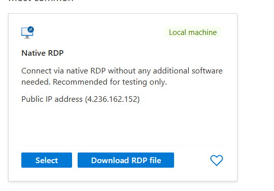

# Create a Virtual Machine and Connect via Microsoft Remote Desktop

This guide explains how to create a virtual machine in Azure and connect to it using Microsoft Remote Desktop (RDP).

---

## Prerequisites
1. An Azure account (see [Create an Azure Account](./azure-account.md)).
2. A Resource Group (see [Create a Resource Group](./resource-group.md)).
3. A Storage Account (see [Create a Storage Account](./storage-account.md)).

---

## Step 1: Create a Virtual Machine

1. Log into the [Azure Portal](https://portal.azure.com).
2. Navigate to **Virtual Machines** from the left-hand menu.
3. Click **+ Create** > **Azure Virtual Machine**.

   

4. Fill out the **Basics** tab:
   - **Subscription:** Select your subscription.
   - **Resource Group:** Choose an existing resource group.
   - **Virtual Machine Name:** Enter a name (e.g., `my-first-vm`).
   - **Region:** Select the same region as your Resource Group.
   - **Image:** Choose an OS (e.g., Windows Server 2022).
   - **Size:** Select a size (e.g., B1ls for cost efficiency).
   - **Administrator Account:** Enter a username and password for RDP access.

5. Configure the **Inbound Port Rules**:
   - Enable **RDP (3389)** to allow remote desktop connections.

6. Click **Review + Create**, then **Create**.

---

## Step 2: Connect to the Virtual Machine

1. Once the VM is deployed, go to the **Virtual Machines** section in the Azure Portal.
2. Click on your VM's name.
3. Select the **Connect** button at the top and choose **RDP**.

   

4. Download the `.rdp` file and open it with Microsoft Remote Desktop.
5. Enter the username and password you created during the VM setup.

---

## Step 3: Access the Virtual Machine

1. Once connected, you’ll have remote access to the VM's desktop environment.
2. Use it as needed for testing, development, or learning.

---

## Tips for Managing Your Virtual Machine
- **Shut Down When Not in Use:** Avoid incurring unnecessary charges.
- **Monitor Costs:** Use the Azure cost management tools to track usage.
- **Secure Access:** Configure Network Security Groups (NSGs) for better security.

---

## What's Next?
- Learn how to manage resources using the Azure CLI.
- Explore deploying apps or services within your virtual machine.
